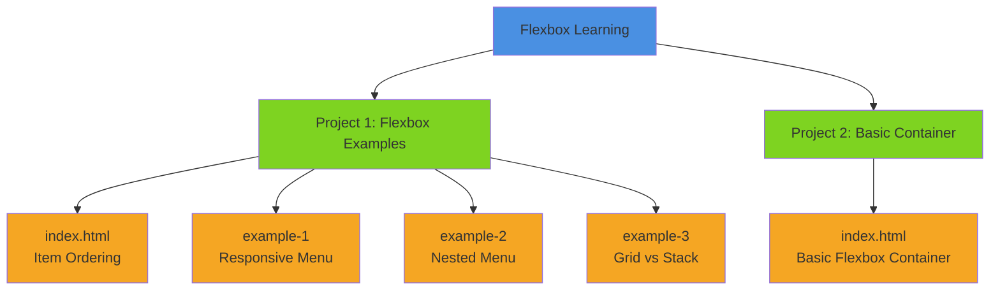
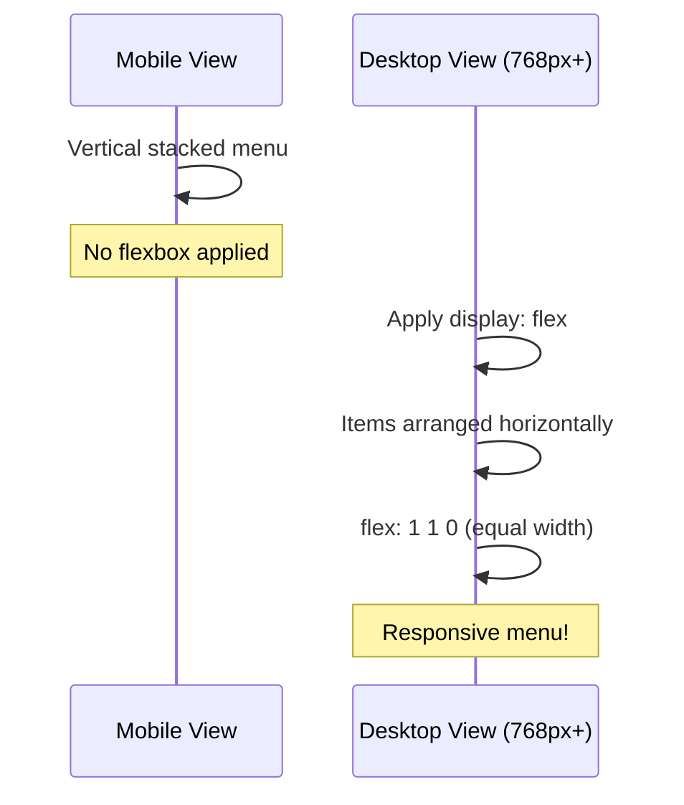
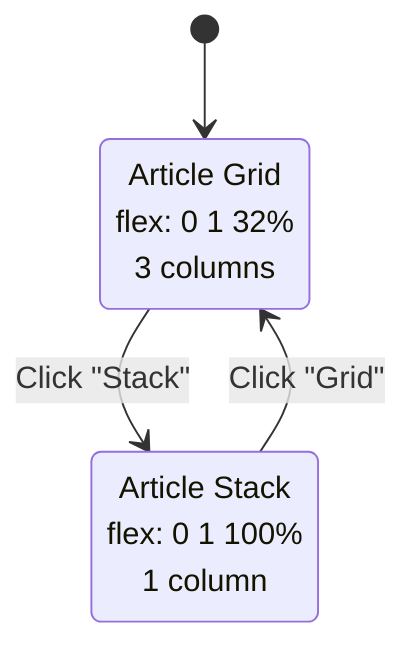

# Flexbox Learning

A collection of practical HTML and CSS examples to learn and practice CSS Flexbox layout techniques.

Built in November 2018. This educational project provides hands-on examples demonstrating various Flexbox properties and patterns including navigation menus, responsive layouts, item ordering, and grid systems.

## Features

- 📱 Responsive navigation menus with mobile-first design
- 🔄 Item reordering using the `order` property
- 🎨 Multiple layout examples (grid, stack, horizontal)
- 📦 Nested flexbox containers
- 🎯 Interactive grid/stack toggle example
- 💡 Clean, well-commented CSS for learning
- 🌐 Cross-browser compatible
- 🚀 No build process - pure HTML & CSS

## Getting Started

### Prerequisites

- A modern web browser (Chrome, Firefox, Safari, or Edge)
- A code editor (VSCode recommended)
- Basic knowledge of HTML and CSS

### Installation

1. Clone the repository:
```bash
git clone https://github.com/orassayag/flexbox-learning.git
cd flexbox-learning
```

2. Open any HTML file in your browser:
   - Use VSCode's Live Server extension, or
   - Double-click any `.html` file to open in your default browser

**No dependencies or build process required!**

## Project Structure



### Project 1 - Flexbox Examples (`project1/`)

| File | Description | Concepts |
|------|-------------|----------|
| `index.html` | Item ordering without changing HTML | `order`, `flex`, `justify-content: space-between` |
| `example-1/menu.html` | Responsive navigation menu | `flex: 1 1 0`, `justify-content: flex-start`, media queries |
| `example-2/nested-menu.html` | Navigation with social media icons | Nested flex containers, `justify-content: space-between` |
| `example-3/grid-vs-stack.html` | Interactive article grid with toggle | `flex-wrap`, `flex-basis`, dynamic layouts, transitions |

### Project 2 - Basic Container (`project2/`)

| File | Description | Purpose |
|------|-------------|---------|
| `index.html` | Simple flexbox container with colored boxes | Starting point for experiments |

## Flexbox Concepts Demonstrated

### Core Properties

```css
/* Create a flex container */
display: flex;

/* Control item growth and size */
flex: 1 1 0;  /* flex-grow flex-shrink flex-basis */

/* Horizontal alignment */
justify-content: space-between;  /* or flex-start, flex-end, center, space-around */

/* Vertical alignment */
align-items: center;  /* or flex-start, flex-end, stretch */

/* Reorder items visually */
order: 2;

/* Allow wrapping */
flex-wrap: wrap;
```

## Example Flows

### Example 1: Responsive Navigation



### Example 3: Grid Toggle Flow



## Learning Path

1. **Start Simple** - Open `project2/index.html` and experiment in the CSS
2. **Learn Ordering** - View `project1/index.html` to see the `order` property
3. **Build Menus** - Progress through `example-1`, `example-2`, `example-3`
4. **Experiment** - Modify the CSS and see results in real-time

## Browser Support

✅ Chrome 29+  
✅ Firefox 28+  
✅ Safari 9+  
✅ Edge 12+  
✅ Opera 17+

## Use Cases

This project demonstrates Flexbox solutions for:
- Responsive navigation bars
- Equal-height columns
- Centering content vertically and horizontally
- Reordering items for different screen sizes
- Building grid layouts without CSS Grid
- Creating flexible card layouts

## Development

### Testing Your Changes

1. Make changes to CSS files
2. Refresh your browser to see results
3. Test responsive behavior by resizing the browser window
4. Use browser DevTools to inspect flexbox properties

### Validation

- [W3C HTML Validator](https://validator.w3.org/)
- [W3C CSS Validator](https://jigsaw.w3.org/css-validator/)

## Additional Resources

- [CSS-Tricks: Complete Guide to Flexbox](https://css-tricks.com/snippets/css/a-guide-to-flexbox/)
- [MDN: Flexbox](https://developer.mozilla.org/en-US/docs/Learn/CSS/CSS_layout/Flexbox)
- [Flexbox Froggy](https://flexboxfroggy.com/) - Learn through games

## Contributing

Contributions are welcome! Please read [CONTRIBUTING.md](CONTRIBUTING.md) for details on the code of conduct and the process for submitting pull requests.

## Author

* **Or Assayag** - *Initial work* - [orassayag](https://github.com/orassayag)
* Or Assayag <orassayag@gmail.com>
* GitHub: https://github.com/orassayag
* StackOverflow: https://stackoverflow.com/users/4442606/or-assayag?tab=profile
* LinkedIn: https://linkedin.com/in/orassayag

## License

This project is licensed under the MIT License - see the [LICENSE](LICENSE) file for details.
